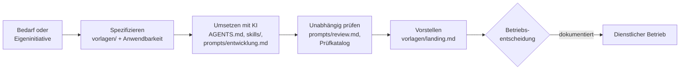

# Verwaltungs-App-Framework – Inhalte für Säule 2

[](https://github.com/janpow77/verwaltung-app-framework/actions/workflows/checks.yml)

[](LICENSE)

**Anforderungen, Agentenanweisungen, Skills und Projektvorlagen für KI-gestützte Fachanwendungen aus der Verwaltung.** Beschäftigte übernehmen die Inhalte beim Start einer eigenen Entwicklung; Claude, Codex oder Gemini setzen die Anwendung anhand von Spezifikation und Vorgaben um, anschließend wird das Projekt im Landingprozess vorgestellt und geprüft.

Inhaltsversion: 0.4.0 · Stand: 2026-09-08. Die Versionsnummer ist keine organisatorische Freigabe.

## Auf einen Blick

- **Verbindliche Anforderungen** F-01 bis F-18 mit Einstufung MUSS / bedingt / SOLL und Anwendbarkeitsmatrix ([Anforderungen](docs/anforderungen.md), [Verbindlichkeit](docs/verbindlichkeit.md)).
- **Projektvorlagen** für Steckbrief, Rollenmatrix, Prozessmodell, VVT und DSFA-Vorprüfung, Testplan, Release und Vorstellung ([vorlagen/](vorlagen/projekt.md)).
- **KI-Arbeitsgrundlage:** gemeinsame Regeln in [AGENTS.md](AGENTS.md), Skills unter `skills/`, wiederverwendbare Aufträge für [Entwicklung](prompts/entwicklung.md) und [unabhängiges Review](prompts/review.md).
- **Prüfkatalog** mit konkreten Prüffällen und Quellenregister zu Standards ([Prüfkatalog](docs/pruefkatalog.md), [Standards](docs/standards.md)).
- **Musterpaket Raumbuchung** als durchgängiges Beispiel vom Steckbrief bis zur Vorstellung ([beispiele/raumbuchung](beispiele/raumbuchung/README.md)).
- **Python-Referenzkern** unter `framework/` mit Tests als ausführbare Referenzlogik für Rechte, Prozess, VVT, DSFA und Export, nicht Teil des Projektpakets.

## Ablauf



Hausbedarf: Bedarf → gemeinsamer Workshop → Vorgaben übernehmen → Entwicklung → Prüfung. Eigeninitiative, auch privat begonnen: Vorgaben übernehmen → Entwicklung → Vorstellung → Prüfung. Erst eine dokumentierte Betriebsentscheidung erlaubt die Übernahme in den dienstlichen Betrieb. Die zehn Schritte mit Eingaben, Ergebnissen und passendem Skill stehen in [docs/ki-arbeitsablauf.md](docs/ki-arbeitsablauf.md).

## Schnellstart

Inhalte in ein eigenes Projekt-Repository übernehmen (gleiche relative Struktur, ohne Archiv und Python-Referenzkern, siehe [docs/start.md](docs/start.md)):

```bash
git clone https://github.com/janpow77/verwaltung-app-framework.git
mkdir mein-projekt
cd verwaltung-app-framework
cp -r README.md INHALTSVERSION AGENTS.md CLAUDE.md CODEX.md GEMINI.md \
      docs contracts skills prompts vorlagen beispiele ../mein-projekt/
git rev-parse HEAD   # verwendeten Framework-Commit im Projekt dokumentieren
```

Danach im eigenen Projekt:

1. Projekt-README anpassen, [Projektsteckbrief](vorlagen/projekt.md) und [Anwendbarkeit](vorlagen/anwendbarkeit.md) ausfüllen; Auslöser F-11 bis F-18 ausdrücklich prüfen.
2. Rollen, Daten und Prozess vor dem ersten Implementierungsauftrag beschreiben, [VVT und DSFA-Vorprüfung](vorlagen/datenschutz.md) führen.
3. Kleine, überprüfbare KI-Aufträge mit [prompts/entwicklung.md](prompts/entwicklung.md) gegen synthetische Testdaten erteilen.
4. Je Anforderung Umsetzung und Prüfung festhalten, mit [prompts/review.md](prompts/review.md) unabhängig prüfen lassen.
5. Projekt mit [vorlagen/landing.md](vorlagen/landing.md) vorstellen.

Eine bloß kopierte Vorlage ist kein erfüllter Nachweis.

<details>
<summary><b>Hier beginnen: empfohlene Lesereihenfolge</b></summary>

1. [Startanleitung](docs/start.md)
2. [Anforderungen und Prüfkriterien](docs/anforderungen.md)
3. [Projektsteckbrief, Rollenmatrix und Prozessmodell](vorlagen/projekt.md)
4. [VVT und DSFA-Vorprüfung](vorlagen/datenschutz.md)
5. [Entwicklungsauftrag](prompts/entwicklung.md) und [unabhängiges Review](prompts/review.md)
6. [Vorstellung und Betriebsbedarf](vorlagen/landing.md)
7. [Zusammenhängendes Musterpaket: Raumbuchung](beispiele/raumbuchung/README.md)
8. [Pflege und Nachnutzung](docs/pflege-und-nachnutzung.md)

</details>

<details>
<summary><b>Verbindliche Inhalte im Überblick</b></summary>

- [MUSS, bedingte Anforderungen und SOLL](docs/verbindlichkeit.md)
- [Administrative Rollen und Kontenlebenszyklus](docs/administration.md)
- [Prüfkatalog](docs/pruefkatalog.md) und [Testplan](vorlagen/testplan.md)
- [Durchgängiger KI-Arbeitsablauf](docs/ki-arbeitsablauf.md)
- [Anwendbarkeit und offene Entscheidungen](vorlagen/anwendbarkeit.md)
- [Inhaltsrelease und Zuständigkeiten](vorlagen/release.md)
- [Standards, Quellen und Nachweise](docs/standards.md)
- [Barrierefreiheit](docs/barrierefreiheit.md), [Sicherheitsvorfälle](docs/security/sicherheitsvorfaelle.md) und [SBOM](docs/security/lieferkette.md)
- [Nutzungsrechte](vorlagen/nutzungsrechte.md) und [Entscheidungsregister](vorlagen/entscheidungen.md)

</details>

<details>
<summary><b>Erweiterte Anwendungsbausteine F-11 bis F-18 (seit 0.3.0)</b></summary>

Für kollaborative, internationale und daten- oder KI-intensive Fachanwendungen gelten die bedingten Anforderungen F-11 bis F-18:

- [Produkt-UX, Mehrfachansichten und Internationalisierung](docs/produkt-ux-und-i18n.md)
- [Capabilities und progressive Freischaltung](docs/capabilities-und-ansichten.md)
- [KI-Provider, Gateways und persönliche Secrets](docs/ki-provider-und-secrets.md)
- [Kollaborative Artefakte: Versionen, Forks, Reviews und Diffs](docs/kollaborative-artefakte.md)
- [Prompt- und Agent-Registry mit Metadaten, Suche und Evaluation](docs/prompt-und-agent-registry.md)
- [Datenimport und semantisches Mapping](docs/datenimport-und-mapping.md)
- [Analytische Reproduzierbarkeit und Workspaces](docs/reproduzierbarkeit-und-workspaces.md)
- [Redaction, Pseudonymisierung und Synthetic Twin](docs/redaction-pseudonymisierung.md)

Besonders für Prompt- und Agent-Registries gilt: Prompts sind versionierte Artefakte mit Metadaten, Commit-Message, Tags/Kategorien/Keywords/Labels, Test-/Eval-Bezug und fachlich lesbarem Diff. Agenten werden über versionierte Manifeste mit Skills, Capabilities, Tools, Datenquellen und Security-Metadaten beschrieben.

</details>

<details>
<summary><b>Umfang und Stand dieser Phase</b></summary>

Das Ergebnis dieser Phase ist das Inhalts-Repository. Mandanten, Nutzerrechte, Akten, Exporte, Datenschutz, Produkt-UX, Registry-Funktionen und Analyse-Workspaces sind Anforderungen an die entstehende Anwendung, soweit nach Anwendbarkeitsmatrix einschlägig. Eine fertige GUI oder produktive Dienste werden in dieser Phase nicht zugesagt.

Unvollständige Softwareentwürfe sind ins [Archiv](archiv/README.md) ausgelagert. Der Python-Kern unter `framework/` bleibt separat als getestete Referenzlogik erhalten. Beides gehört nicht zum zu übernehmenden Projektpaket. Details: [ADR-004](docs/adr/ADR-004-inhalts-framework.md). Änderungen je Version: [CHANGELOG.md](CHANGELOG.md).

**Zwei Säulen im Pilotprogramm:** Datenauswertungen werden im Workshop fachlich aufgesetzt. Dieses Inhalts-Framework unterstützt insbesondere Säule 2: eigene Fachanwendungen mit Formularen, Vorgängen und Berechtigungen. Hausbedarf und Eigeninitiative sind beide mögliche Einstiege.

**Agenteneinstiege:** [AGENTS.md](AGENTS.md) ist die gemeinsame Arbeitsgrundlage; [CLAUDE.md](CLAUDE.md), [CODEX.md](CODEX.md) und [GEMINI.md](GEMINI.md) verweisen darauf. Skills konkretisieren Aufgaben; die Umsetzung und ihre Nachweise werden im jeweiligen Projekt geprüft.

</details>

<details>
<summary><b>Prüfungen des Repositorys</b></summary>

Voraussetzung: Python 3.11 oder neuer, keine weiteren Abhängigkeiten.

```console
$ python3 -m unittest discover -s tests
.....................................................
----------------------------------------------------------------------
Ran 53 tests in 0.058s

OK
$ python3 checks/validate_repo.py
Framework-Struktur vollständig: 63 Pflichtdateien, Verträge stimmen mit Modell und Statusmaschine überein; Standardszuordnungen konsistent (kein Konformitätsnachweis)
```

Diese Prüfungen betreffen Referenzkern und Inhaltsstruktur, nicht die Betriebsfähigkeit einer erzeugten Anwendung. Die CI ([`.github/workflows/checks.yml`](.github/workflows/checks.yml)) führt sie bei jedem Push und Pull Request aus, ergänzt um `bandit` und eine Geheimnissuche mit gitleaks.

</details>

## Mitwirkung und Sicherheit

Beiträge nach [CONTRIBUTING.md](CONTRIBUTING.md): Der Framework-Kern bleibt generisch und wird nur mit ADR, Tests und Review erweitert; für Authentifizierung, Freigaben, Audit und Exporte gilt das Vier-Augen-Prinzip. Sicherheitslücken nicht öffentlich melden, siehe [SECURITY.md](SECURITY.md).

## Lizenz

Die Inhalte dieses Repositorys stehen unter der [MIT-Lizenz](LICENSE), Copyright (c) 2026 Jan Riener. Übernommene Drittinhalte behalten ihre eigenen Bedingungen. Zur Nachnutzung siehe [Nutzungsrechte](vorlagen/nutzungsrechte.md) und [Pflege und Nachnutzung](docs/pflege-und-nachnutzung.md).
