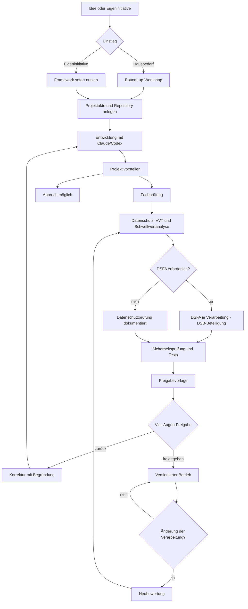

# Prozessmodell für Projektakte und Landingprozess

## Grundidee

Das Framework verbindet Statusmaschine, Akte, Chronologie, Fristen, Dokumente
und Freigabegates. Jeder Statuswechsel ist eine fachliche Handlung mit Person,
Zeit, Begründung sowie Vorher/Nachher. Ein Übergang außerhalb der Matrix ist
nicht zulässig.

## Zwei zulässige Einstiege

### Hausbedarf

```text
Idee eingegangen → Workshop → Framework angelegt → Entwicklung
```

### Eigeninitiative

```text
Eigene Idee → Framework angelegt → Entwicklung → Projekt vorstellen
```

Die zweite Route verhindert Schatten-IT, weil die Entwicklung nicht erst nach
einer Genehmigung in das Framework wechseln muss. Das Framework ist von Anfang
an verfügbar. Die spätere Vorstellung ist der geregelte Landingprozess.

## Prozessgrafik



## Akte und Nachweise

Die Projektakte enthält mindestens:

- Projektsteckbrief, verantwortliche Personen und Mandant
- Repository-/Release-Referenz und verwendete Framework-Version
- Rollenmatrix und Workflowbeschreibung
- Datenquellen, Datenkategorien und VVT-Tätigkeit
- Schwellwertanalyse und gegebenenfalls DSFA-Snapshot
- Sicherheitsbaseline, Tests, Abhängigkeiten und offene Risiken
- Präsentations-/Landingprotokoll und Freigabeentscheidung
- Dokumente, Exporte, Fristen und unveränderliche Chronologie
